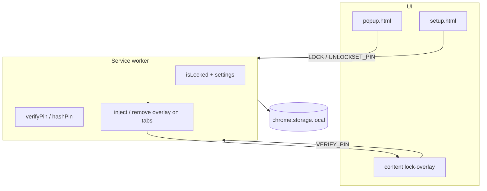

# Browser Lock Extension — Plan

## Goal

A Chrome extension (Manifest V3) that locks the browser behind a PIN so other people cannot see your tabs or browse until you unlock it—similar to “Browser Lock” / Chrome Lock style products.

## MVP (this sample)

| Feature | Status |
|--------|--------|
| First-run PIN setup (4–8 digits) | ✅ |
| Hash PIN locally (PBKDF2 + salt) | ✅ |
| Manual lock from toolbar popup | ✅ |
| Auto-lock when browser starts | ✅ (toggle in setup) |
| Pinned lock screen tab (whole browser, incl. brave://) | ✅ v0.2 |
| Tab guards — cannot stay on other tabs while locked | ✅ v0.2 |
| Full-screen overlay on web tabs (backup) | ✅ |
| New tabs get overlay while locked | ✅ |
| Unlock with correct PIN | ✅ |
| Wrong PIN feedback (no hint of length) | ✅ |
| Idle auto-lock (minutes) | ✅ (optional, setup) |

## Not in MVP (later)

- Biometrics (WebAuthn / Windows Hello)
- Security questions / PIN recovery
- Per-tab or per-domain lock only
- Block DevTools / extension disable (not fully possible in Chrome)
- Sync across devices
- Premium / accounts

## Architecture



### Components

1. **`background.js`** — Source of truth for `isLocked`, PIN verification, tab events, idle alarm.
2. **`crypto.js`** — PBKDF2-SHA256 (100k iterations) for PIN hashing; never stores plaintext PIN.
3. **`content/lock-overlay.js` + `.css`** — Injected on pages when locked; blocks interaction; collects PIN.
4. **`popup.html`** — Quick lock, status, link to settings.
5. **`setup.html`** — Set/change PIN, auto-lock on startup, idle timeout.

### Security notes (honest)

- This is a **privacy deterrent**, not kernel-level security. Anyone with admin access or who disables extensions can bypass it.
- PIN and hash stay in **`chrome.storage.local`** on the device only.
- Use a **strong PIN** and OS user account lock for real protection.

## How to test

1. Open `chrome://extensions`
2. Enable **Developer mode**
3. **Load unpacked** → select the `browser-lock` folder
4. Complete setup (PIN + options)
5. Click extension icon → **Lock now**
6. Try switching tabs, opening new tabs — overlay should remain until PIN unlock
7. Restart Chrome with “Auto-lock on startup” enabled — should start locked

## File layout

```
browser-lock/
  manifest.json
  background.js
  crypto.js
  popup.html / popup.js / popup.css
  setup.html / setup.js / setup.css
  content/
    lock-overlay.js
    lock-overlay.css
  icons/
  PLAN.md
  README.md
```

## Roadmap

1. **v0.1** (this sample) — PIN lock + overlay + auto-lock
2. **v0.2** — Change PIN (require current PIN), export nothing
3. **v0.3** — WebAuthn unlock where supported
4. **v0.4** — Optional “lock only these sites” mode
